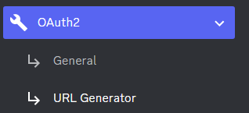

# ChatGPT Discord Bot Template

This template was adapted from [here](https://github.com/Zero6992/chatGPT-discord-bot)

Reverse Engineered ChatGPT by OpenAI [here](https://github.com/acheong08/ChatGPT). 

# Setup

This assumes you have a Discord account, server and a role in that server with priviliges to set up a bot.

## Create a Discord bot

1. Go to https://discord.com/developers/applications create an application.
2. And build a bot under the application.
3. Get the token from Bot setting.
   
4. Store the token in Secrets as an environment variable with the name `DISCORD_BOT_TOKEN`
   
5. Turn MESSAGE CONTENT INTENT `ON`
   
6. Invite your bot through OAuth2 URL Generator
   

## Get your session token
Go to https://chat.openai.com/chat from the Chrome browser and log in
1. Open Chrome DevTools 
2. Open `Application` tab > Cookies
   
3. Copy the value for `__Secure-next-auth.session-token` and add it to Secrets as an environment variable with the name `CHAT_GPT_SESSION_TOKEN`
   

## DM your ChatGPT bot in Discord

   